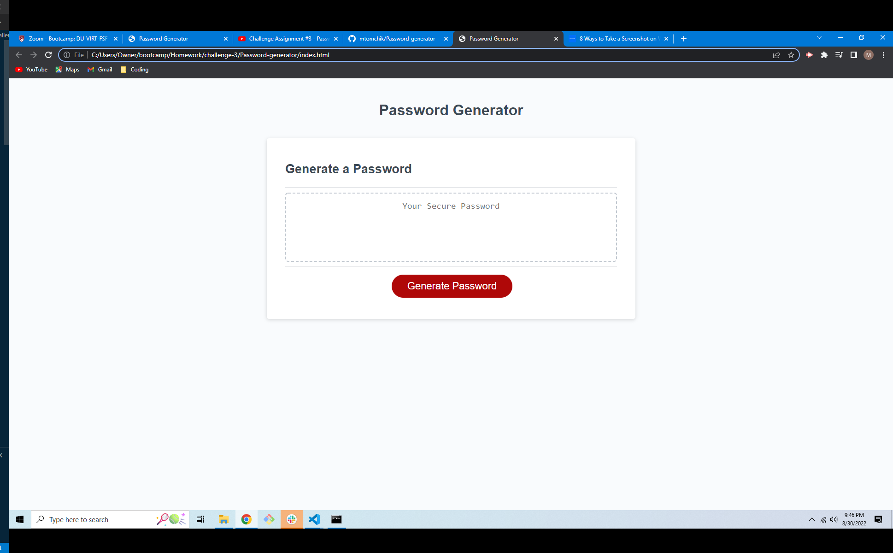

Password Generator

Description
this is a random password generator that can create passwords containing numbers, uppercase letters, lowercase letters, and special characters in any combination.

Visuals: 

Usage
You can use this to generate andom passwords for anything you might need a password for and clarify what parameters it should require.

Support
email Matt at Matthew.tomchik@yahoo.com

Authors and acknowledgment
Me and my instructr Jay and his TAs Rob and Maria. Big shout out to William Horn on Youtube for showing me how to write the code and explaining how various parts of the code interact with eachother.
